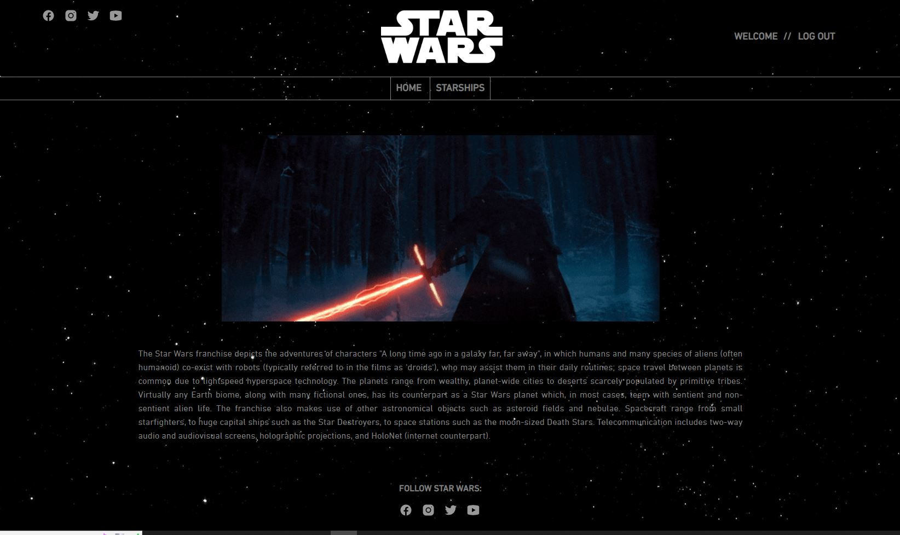
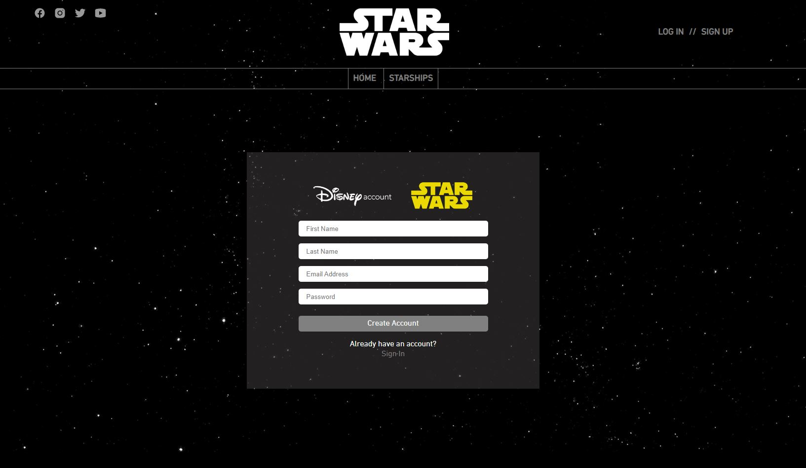

# S8. Star Wars - Starships viewer

## Description

This app was created as the 8th exercise from IT Academy - Barcelona.

In this app you will be able to see all information about all Star Wars Starships.

[See deployed web here](https://laura-ruiz.github.io/starwars-sprint8/)

## Screen shots

## How to install

1. Clone this repository
   > `git clone https://github.com/Laura-Ruiz/perritos-adoption.git`
2. Access the app directory
   > `cd <repository folder>`
3. Installation
   > `npm install`
4. Run
   > `npm run start`

## How to use

**Important You need to put your own API keys in order to use app.**
